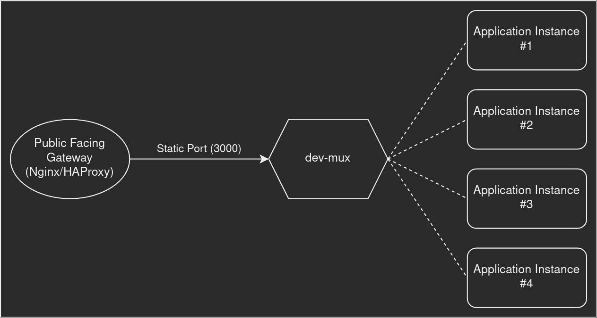

# dev-mux

Dynamic CI/CD Development Multiplexer

## What is it?

```txt
A Dynamic CI/CD Development Multiplexer
     |      |       |            |
     |      |       |            A gateway to running instances
     |      |       It's not fast, and should not be used in production
     |      I personally use it in CI/CD environments for multiple instances
     No need to reloads or restarts. Changes will be applied on the next request
```

### Which problem does it solve?

In CI/CD environments where you might have many Server-Side Rendered (SSR) application instances running on the same machine, and each might listen to a different, and even a random port, popular gateways like `nginx` will not help much, because they cannot get configured during their runtime and they should be restarted after each change in their configuration.

One solution is to have a gateway which distributes requests it receives to application instances that are attached to it, based on a _base URL_ they are interested in. It launches two servers, one is the gateway itself, which routes the requests to application instances. Other one, is the _operation_ server, which application instances can issue requests to it, for attach/detach operations.

Personally, I want to have the following architecture:



*[Credit: <https://app.diagrams.net/>]*

So, if you have the same problem, dev-mux might help you! 😃

### Usage

npx:

  ```sh
  npx @medxfactor/dev-mux
  ```

It will start the `dev-mux` operation server at `http://127.0.0.3001` and gateway server at `http://127.0.0.3000`.

You can change each server host and port by providing [options](#options) to `dev-mux`.

### Options

Executing `dev-mux` with `--help`, will print:

```sh

  CI/CD Development Environment Multiplexer

  Usage:
    dev-mux [options]

  Options:
    --operation-port          Preferred operation server port.  [default: 3001]
    --operation-host          Preferred operation server host.  [default: '127.0.0.1']
    --gateway-port            Preferred gateway server port.    [default: 3000]
    --gateway-host            Preferred gateway server host.    [default: '127.0.0.1']
    --help, -h                Prints this help message and exists.
    --version, -v             Prints dev-mux version (0.3.0) and exists.

```

### Operation Server Endpoints

Operation server have two endpoints:

- `PUT /attach`:

  Used to request for attaching a server to a _base URL_.

  Example:

  ```sh
  curl \
      --request PUT \
      --url http://localhost:3001/add-me \
      --header 'Content-Type: application/json' \
      --data '{
          "host": "127.0.0.1",
          "port": 8090,
          "listeningUrl": "/send-me"
      }'
  ```

- `PUT /detach`:

  Used to request for detaching a server from a _base URL_.

  Example:

  ```sh
  curl \
      --request PUT \
      --url http://localhost:3001/add-me \
      --header 'Content-Type: application/json' \
      --data '{
          "listeningUrl": "/im-listening"
      }'
  ```
